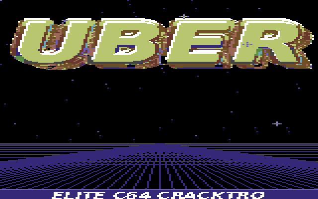

# C64 UBER Logo Effects

An ACME-assembled Commodore 64 demo that presents the supplied full-screen UBER multicolor bitmap, then transitions through a charset tunnel and a wire-cube effect. The repository also preserves the validated reusable UBER logo asset pack.



## What is included

- `c64_uber_logo_effects.asm` — the production demo source.
- `assets/logo-pack/` — nine validated bitmap, character, and sprite logo variants with their ACME sources and raw asset files.
- `scripts/` — deterministic asset, memory-layout, and PRG-stub validators.
- `docs/` — the memory map and audit record.

The program loops through this sequence:

1. Full-screen 320×200 multicolor UBER logo and border pulse.
2. Charset tunnel.
3. Coarse wire-cube animation.

## Build and run

Requirements: [ACME](https://sourceforge.net/projects/acme-crossass/) and Python 3. `x64sc` from VICE is optional for running the result.

```sh
make build
make run
```

`make build` validates every retained logo asset, validates the assembly memory plan, assembles with ACME's strict segment checking, and verifies the resulting PRG's `$0801` load address and `SYS 16384` stub. The output is `build/c64_uber_logo_effects.prg`.

To run a previously built demo:

```sh
x64sc build/c64_uber_logo_effects.prg
```

## Memory safety

The original integrated V14 source attempted to embed the entire 23,900-byte asset collection at `$7000`, which collided with its cube data and could not assemble. This version embeds only the 10,000 bytes the runtime actually displays and leaves the other validated assets available as source material. See [the memory map](docs/MEMORY_MAP.md) and [audit](docs/AUDIT.md).

## Asset pack

`assets/logo-pack/manifest.json` defines the preserved assets: four multicolor bitmap variants, two hires bitmap variants, two charset variants, and one sprite logo. Run:

```sh
python3 scripts/validate_logo_pack.py
```

The pack is retained as supplied source material. No software license was included with the input archives, so no new redistribution license is asserted here.

## Repository scope

The supplied Pulsegrid and Super Cube projects were built and compared separately. They are independent C64 programs with incompatible rendering and memory layouts; Pulsegrid already has public repositories (`djayuffe/euro-pulsegrid` and `djayuffe/C64-Pulsegrid`). This repository therefore focuses only on the independently useful UBER logo/effects work rather than incorrectly merging unrelated demos.
